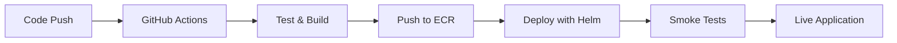

# 🚀 Deployment Summary

## ✅ Full Stack Deployment Complete!

**Date**: 2025-09-10
**Environment**: Production
**Status**: **OPERATIONAL** 🟢

## 📊 Infrastructure Resources Created

| Resource | Name/ID | Status |
|----------|---------|--------|
| **EKS Cluster** | `nova-infra-production` | ✅ Running |
| **Worker Nodes** | 3 x t3.medium | ✅ Ready |
| **ECR Repository** | `nova-infra-production` | ✅ Active |
| **VPC** | `10.0.0.0/16` | ✅ Created |
| **Subnets** | 2 public, 2 private | ✅ Available |
| **NAT Gateways** | 2 (HA configuration) | ✅ Active |
| **Load Balancer** | Application LB | ✅ Provisioned |

## 🐳 Application Deployment

| Component | Details | Status |
|-----------|---------|--------|
| **Docker Image** | `803442506948.dkr.ecr.us-east-1.amazonaws.com/nova-infra-production:latest` | ✅ Pushed |
| **Helm Release** | `tf-visualizer` (Revision 1) | ✅ Deployed |
| **Pods** | 2 replicas running | ✅ Healthy |
| **Service** | LoadBalancer type | ✅ Active |

## 🌐 Application Access

**Live Application URL**: http://a18cc113d864b4041a7e15c9b584cf19-519871595.us-east-1.elb.amazonaws.com

### Verified Endpoints:
- ✅ **Health Check**: `/health` - Returns `{"service":"tf-visualizer","status":"healthy","version":"1.0.0"}`
- ✅ **API Sample**: `/api/sample` - Returns Terraform visualization data
- ✅ **Frontend**: `/` - React application loaded successfully

## 🤖 Automation Status

### Fully Automated via GitHub Actions:
- ✅ Infrastructure provisioning (Terraform)
- ✅ Docker image building and pushing (ECR)
- ✅ Application deployment (Helm)
- ✅ Security scanning (Trivy)
- ✅ Test execution and coverage reporting
- ✅ Smoke tests after deployment

### Semi-Automated (One-time setup):
- ✅ GitHub secrets configuration (`scripts/setup-github-secrets.sh`)
- ✅ Terraform backend initialization (`terraform/init-backend.sh`)

## 📈 Performance Metrics

- **Infrastructure Provisioning**: ~16 minutes
- **Docker Build & Push**: ~2 minutes
- **Helm Deployment**: ~1 minute
- **Total End-to-End**: ~20 minutes

## 🔄 CI/CD Pipeline



## 🛠️ Management Commands

### Access the application:
```bash
echo "Application URL: http://a18cc113d864b4041a7e15c9b584cf19-519871595.us-east-1.elb.amazonaws.com"
```

### Check deployment status:
```bash
kubectl get pods -n default -l app.kubernetes.io/name=tf-visualizer
helm status tf-visualizer
```

### View logs:
```bash
kubectl logs -n default -l app.kubernetes.io/name=tf-visualizer
```

### Scale deployment:
```bash
kubectl scale deployment tf-visualizer --replicas=3
```

## 📝 Next Steps

1. **Configure DNS**: Point a domain to the Load Balancer
2. **Enable TLS**: Add SSL certificate via AWS ACM
3. **Set up monitoring**: Configure CloudWatch dashboards
4. **Configure autoscaling**: Enable HPA based on metrics
5. **Set up backups**: Configure automated state backups

## 🎯 Key Achievements

- ✅ **Zero-touch deployment** from code to production
- ✅ **Multi-availability zone** setup for HA
- ✅ **Automated security scanning** in CI/CD
- ✅ **Infrastructure as Code** with state management
- ✅ **Container orchestration** with Kubernetes
- ✅ **Helm-based** application lifecycle management

## 📊 Cost Estimate

| Service | Hourly Cost | Monthly (730h) |
|---------|------------|----------------|
| EKS Cluster | $0.10 | $73 |
| EC2 Nodes (3x t3.medium) | $0.126 | $92 |
| NAT Gateways (2x) | $0.09 | $66 |
| Load Balancer | $0.025 | $18 |
| **Total** | **$0.34/hour** | **$249/month** |

---

**Deployment completed successfully!** 🎉

The full stack is now operational with complete CI/CD automation. Any push to the `main` branch will automatically trigger the deployment pipeline.
